# ISYE 6740 Final Project

**Course:** ISYE 6740  
**Group:** Group #285  
**Student:** Kar Chyi Chang (Kchang327)  
**Date:** May 3, 2026  
**Project Title:** Graph-Based Spectral Analysis of Paddy Farming Practices

# Graph-Based Spectral Analysis of Paddy Farming Practices

## 1. Introduction

Agricultural production depends on a combination of farm size, crop variety, soil type, fertilizer application, weather, irrigation, and other cultivation practices. In this project, the UCI Paddy Dataset was analyzed to identify groups of farms with similar farming profiles and to detect farms that deviate from typical patterns. The central question was whether farms could be represented as a similarity network and then grouped into interpretable clusters of farming practices.

The project began with a graph-based spectral clustering proposal. During implementation, the analysis was expanded to include exploratory data analysis, preprocessing, PCA dimensionality reduction, graph construction, spectral clustering, baseline clustering comparisons, cluster interpretation, anomaly detection, and a web portal. During evaluation, spectral clustering was compared with simpler baseline methods. The final interpretation uses k-means clustering because it produced the strongest internal validation scores, while spectral clustering remains an important graph-based comparison method.

## 2. Dataset

The dataset contains 2,789 farm records and 45 original variables. The variables include farm characteristics, agriblock, crop variety, soil type, nursery practice, seed rate, fertilizer applications, pesticide usage, rainfall, irrigation, temperature, wind, relative humidity, trash bundles, and paddy yield. In this context, `Agriblock` refers to the agricultural block or local farming region where the observation was recorded. The dataset includes six agriblocks: Chinnasalem, Cuddalore, Kallakurichi, Kurinjipadi, Panruti, and Sankarapuram.

The dataset had no missing values. However, the preprocessing pipeline still includes imputation as a safeguard for future data or portal uploads. The initial EDA found 451 duplicate rows beyond the first occurrence, which is relevant because duplicate or repeated farm profiles can influence PCA, graph construction, and clustering.

The target-like outcome column, `Paddy yield(in Kg)`, was excluded from clustering features. It was preserved separately and used only after clustering to interpret whether the discovered groups were meaningful.

## 3. Preprocessing

The preprocessing workflow cleaned column names, separated numeric and categorical variables, standardized numeric features, and one-hot encoded categorical features. Standardization was important because the numeric variables were measured on different scales, such as hectares, kilograms, tonnes, millimeters, milliliters, and temperature. Without standardization, variables with larger raw magnitudes could dominate Euclidean distances and distort PCA or clustering results.

The original feature set used for clustering contained 44 input columns after excluding yield. Of these, 36 were numeric and 8 were categorical. The categorical columns produced 35 one-hot encoded columns, resulting in 71 processed feature columns.

The categorical variables included:

| Feature | Unique categories |
| --- | ---: |
| Agriblock | 6 |
| Variety | 3 |
| Soil Types | 2 |
| Nursery | 2 |
| Wind Direction_D1_D30 | 6 |
| Wind Direction_D31_D60 | 5 |
| Wind Direction_D61_D90 | 5 |
| Wind Direction_D91_D120 | 6 |

## 4. PCA Dimensionality Reduction

Principal Component Analysis was applied to the 71 processed features. PCA showed that the data could be reduced substantially while retaining most of the variance.

Key PCA results:

| Component summary | Value |
| --- | ---: |
| PC1 explained variance | 28.95% |
| PC2 explained variance | 28.65% |
| PC1 + PC2 cumulative variance | 57.60% |
| Components needed for 95% variance | 6 |

The first two components were used for visualization, while the first six components were used for graph construction, clustering, and anomaly detection. This reduced noise and avoided performing distance-based clustering in the full 71-dimensional encoded feature space. The cumulative explained variance plot shows that the first six components preserve at least 95% of the variance, making six components a reasonable modeling choice.

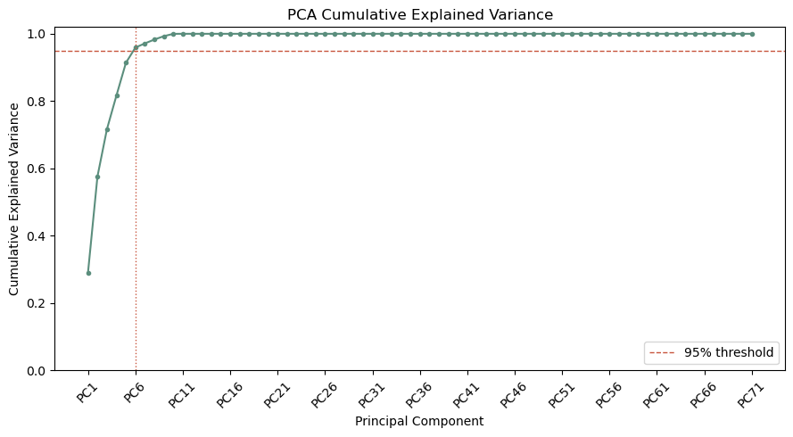

The two-dimensional PCA projection also shows a structured pattern rather than a random cloud. When the points are colored by yield, yield varies strongly across the projection, indicating that some PCA directions are closely related to farm scale and input intensity.

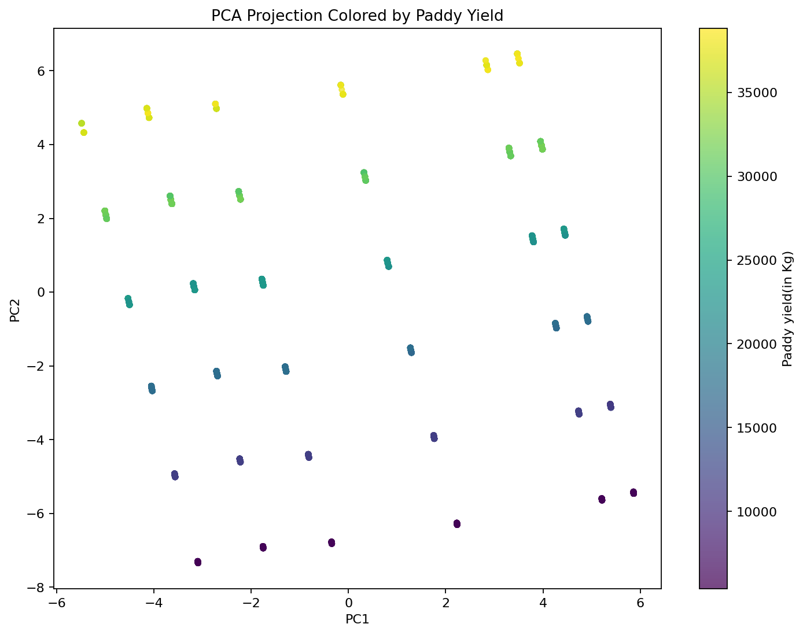

## 5. Similarity Graph Construction

A similarity graph was constructed using the first six PCA components. Each farm was represented as a node. Edges were created using a k-nearest-neighbor approach, and edge weights were computed with a Gaussian similarity function based on Euclidean distance in PCA space. The purpose of the graph was to represent farms as a network of similar observations, so that graph-based spectral clustering could use the connectivity structure rather than only direct point-to-point distances.

Smaller nearest-neighbor values produced highly disconnected graphs. For example, `k=10` produced 147 connected components. The graph became fully connected at `k=400`, so that value was used for the final similarity graph.

Final graph summary:

| Metric | Value |
| --- | ---: |
| Nodes | 2,789 |
| Edges | 632,680 |
| Nearest neighbors | 400 |
| PCA components used | 6 |
| Connected components | 1 |
| Median degree | 440 |
| Mean degree | 453.70 |

This graph was used for spectral clustering and graph-based anomaly features. The graph overlay on the PCA projection gives a visual sense of how farms are connected in the reduced feature space.

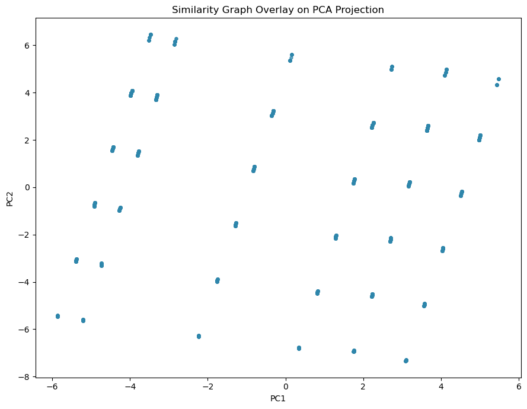

## 6. Clustering Methods

Three clustering approaches were compared:

1. Spectral clustering using the similarity graph
2. K-means clustering on the six PCA components
3. Hierarchical Ward clustering on the six PCA components

Cluster counts from `k=2` through `k=10` were evaluated. The metrics used were silhouette score, Calinski-Harabasz score, and Davies-Bouldin score.

Best results by method:

| Method | k | Silhouette | Calinski-Harabasz | Davies-Bouldin |
| --- | ---: | ---: | ---: | ---: |
| k-means | 10 | 0.5999 | 1907.69 | 0.6835 |
| spectral | 10 | 0.5886 | 1901.57 | 0.7365 |
| hierarchical Ward | 10 | 0.5650 | 1802.53 | 0.7555 |

K-means slightly outperformed spectral clustering across the internal validation metrics. Since the difference was not large, this suggests that both k-means and spectral clustering found similar structure in the PCA-reduced space. K-means was selected as the final model for cluster interpretation because it had the best validation scores.

The silhouette comparison plot shows that all three methods improved as the number of clusters increased within the tested range. Since the best score occurred at `k=10`, future work could test larger values such as `k=11` through `k=15`. For this project, however, `k=10` was kept as the final cluster count because it was the best value within the planned evaluation range.

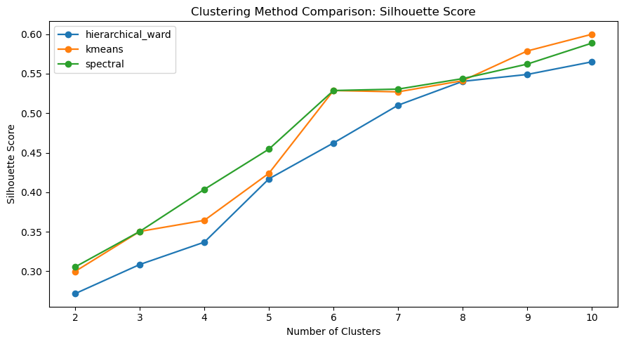

## 7. Cluster Interpretation

The final k-means model used `k=10`. Cluster profiling showed that the discovered groups are strongly associated with farm/input scale and agriblock. Higher-yield clusters generally had larger average hectares and larger input quantities.

Cluster summary:

| Cluster | Farms | Avg yield kg | Avg hectares | Dominant agriblock | Dominant variety | Dominant soil | Dominant nursery |
| ---: | ---: | ---: | ---: | --- | --- | --- | --- |
| 6 | 368 | 29,363.57 | 4.76 | Sankarapuram | delux ponni | clay | dry |
| 9 | 289 | 29,325.22 | 4.76 | Kurinjipadi | ponmani | clay | dry |
| 2 | 240 | 29,231.16 | 4.76 | Kallakurichi | ponmani | clay | dry |
| 7 | 265 | 29,145.81 | 4.76 | Cuddalore | delux ponni | clay | dry |
| 4 | 313 | 26,496.97 | 4.35 | Chinnasalem | ponmani | clay | dry |
| 5 | 425 | 22,328.97 | 3.69 | Panruti | delux ponni | clay | dry |
| 1 | 237 | 13,015.99 | 2.27 | Sankarapuram | delux ponni | clay | dry |
| 0 | 197 | 12,764.93 | 2.22 | Kurinjipadi | ponmani | clay | dry |
| 3 | 185 | 12,657.78 | 2.20 | Cuddalore | delux ponni | clay | dry |
| 8 | 270 | 11,324.11 | 1.97 | Kallakurichi | ponmani | alluvial | dry |

High-yield clusters included clusters 6, 9, 2, and 7. These had average yields around 29,100 to 29,400 kg and average farm sizes around 4.76 hectares. Low-yield clusters included clusters 1, 0, 3, and 8. These had average yields around 11,300 to 13,000 kg and average farm sizes around 2 hectares.

This indicates that the clustering model is capturing meaningful differences in farm scale, input intensity, and regional farming profiles. The clusters are not arbitrary labels; they correspond to distinct combinations of agriblock, farm size, input levels, and yield outcomes.

The average-yield chart makes the scale separation especially clear. Clusters with larger farm area and higher input levels also tend to have higher total yield.

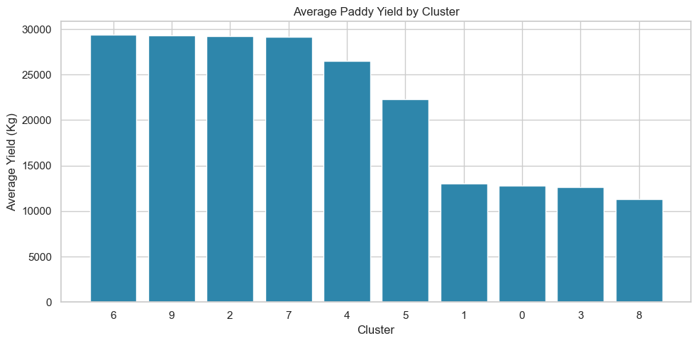

The cluster profile heatmap standardizes key numeric variables across clusters. Positive values indicate a cluster is above the overall average for that variable, while negative values indicate it is below the overall average. This helps show that high-yield clusters are also generally higher in hectares, seed rate, fertilizer input, pesticide use, and trash bundles.

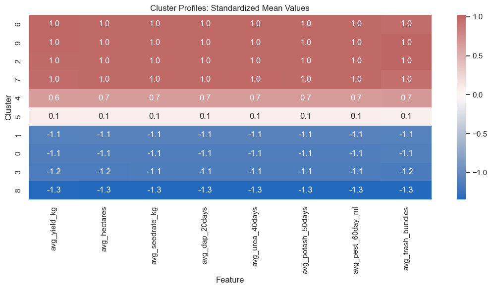

The yield boxplot shows the spread of yield within each cluster and helps confirm that cluster-level yield differences are not only driven by single extreme values.

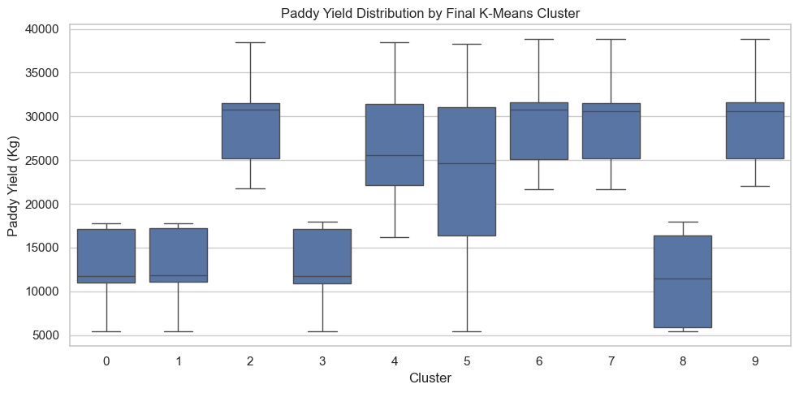

## 8. Anomaly Detection

Anomaly detection combined three unsupervised signals:

| Signal | Weight |
| --- | ---: |
| Distance from assigned cluster centroid | 45% |
| Isolation Forest anomaly score | 45% |
| Low weighted graph degree | 10% |

The top 5% most anomalous farms were flagged, producing 139 top anomalies. Cluster 8 had the largest number of top anomalies, with 38 farms in the top 5%. Clusters 6 and 9 had zero top-5% anomalies, suggesting they were more internally consistent.

Example top anomaly:

| Field | Value |
| --- | --- |
| Node | 2786 |
| Cluster | 8 |
| Hectares | 1 |
| Agriblock | Chinnasalem |
| Variety | delux ponni |
| Soil type | clay |
| Seedrate | 25 kg |
| Nursery | wet |
| Paddy yield | 5,723 kg |
| Combined anomaly score | 0.9818 |

The strongest anomalies were mostly very small one-hectare farms with low seed rates, low fertilizer inputs, and low yields. These farms were far from their assigned cluster centers and were also flagged by Isolation Forest. Cluster 8 had the highest concentration of top anomalies, which is consistent with its lower average hectares and lower average yield.

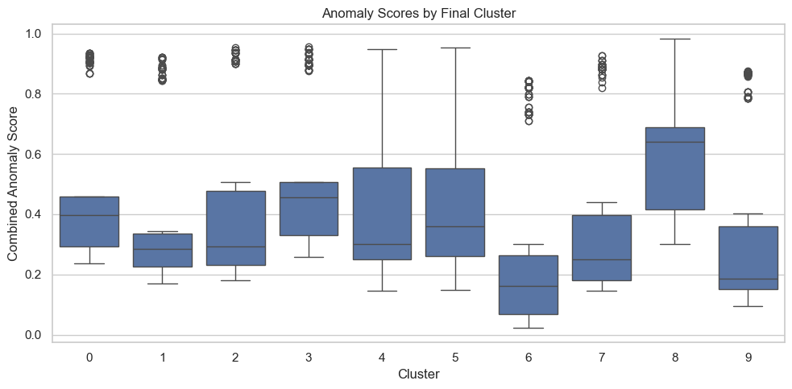

The anomaly score distribution shows that most farms have moderate anomaly scores, while a smaller group of farms separates into the high-anomaly tail.

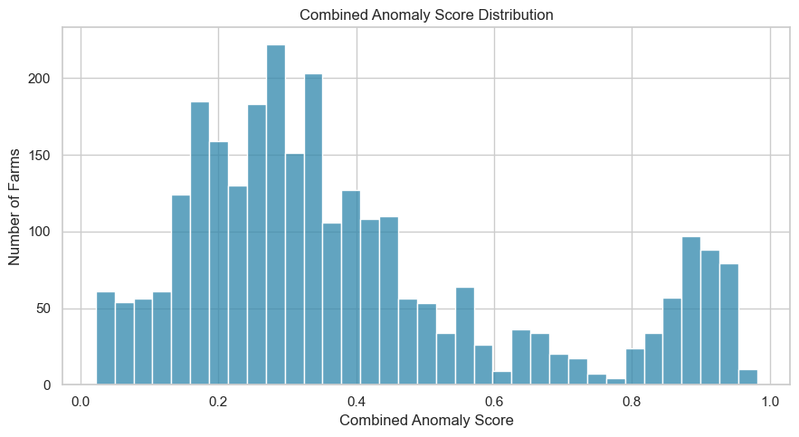

## 9. Web Portal Exploration

As an exploratory supplement to the analysis, a static web portal was built to organize and review the project results visually. The portal itself is not the main submitted artifact; rather, it was used as a supporting tool to inspect PCA projections, cluster profiles, model comparisons, graph connectivity, and anomaly results in one place. This helped verify whether the generated tables and figures told a coherent story.

The overview screen shows the main project metrics and allows the PCA projection to be colored by cluster, yield, or anomaly score. This made it easier to compare the geometric PCA structure with the final clustering and anomaly results.

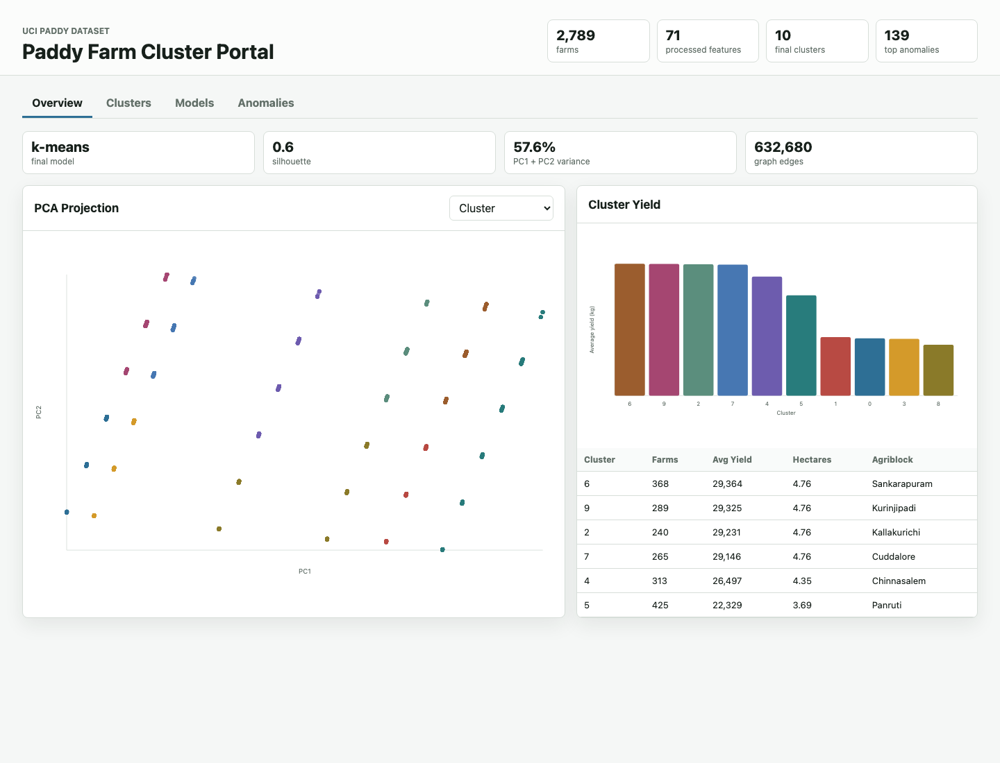

The model comparison screen summarizes validation scores, PCA explained variance, and graph connectivity. This view was useful for explaining why k-means was selected as the final model even though the original proposal focused on spectral clustering.

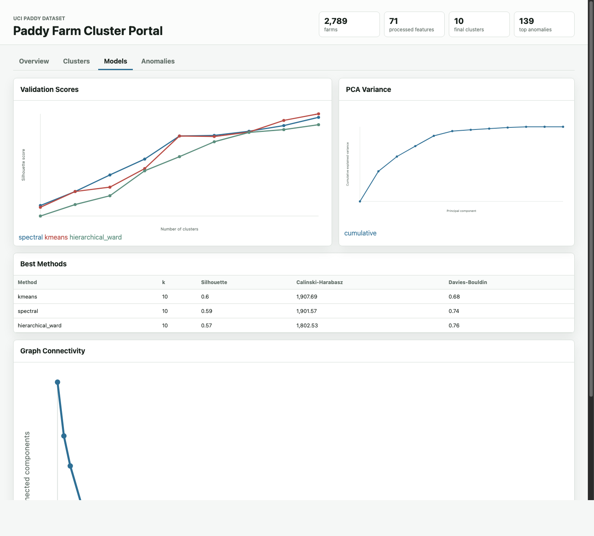

The anomaly screen displays the number of anomalous farms by cluster and lists the highest-ranked anomalous observations. This made the anomaly detection results easier to interpret than reviewing the CSV output alone.

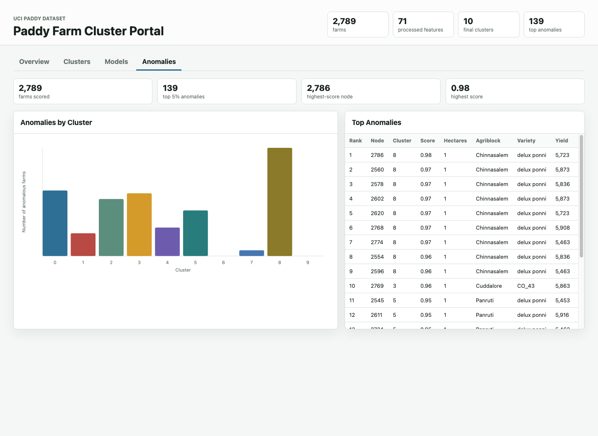

## 10. Limitations

The analysis is unsupervised, so there are no true cluster labels to validate against. Internal validation metrics are useful, but they do not prove that a clustering result is agronomically optimal.

The dataset also contains repeated or duplicate rows. These repeated profiles may reflect real repeated farm conditions, data collection patterns, or duplication artifacts. They should be discussed as a limitation because they can affect similarity graph structure and cluster compactness.

Yield appears highly related to farm size and input quantities. Therefore, the clusters may primarily reflect scale and input intensity rather than purely qualitative differences in farming strategy. A possible future extension would normalize yield by hectares and analyze yield efficiency instead of total yield.

## 11. Conclusion

This project identified meaningful structure in the UCI Paddy Dataset using preprocessing, PCA, graph construction, clustering, baseline comparison, cluster interpretation, and anomaly detection.

Although spectral clustering was the original graph-based method, k-means slightly outperformed spectral clustering on internal validation metrics. The final k-means model with 10 clusters revealed interpretable farm groups driven mainly by agriblock, farm size, input levels, and yield. Anomaly detection further identified farms with unusual low-scale, low-input, and low-yield profiles.

Overall, the project shows that unsupervised learning can uncover useful patterns in paddy farming practices and can support exploratory agricultural analysis through cluster profiling and anomaly detection.
